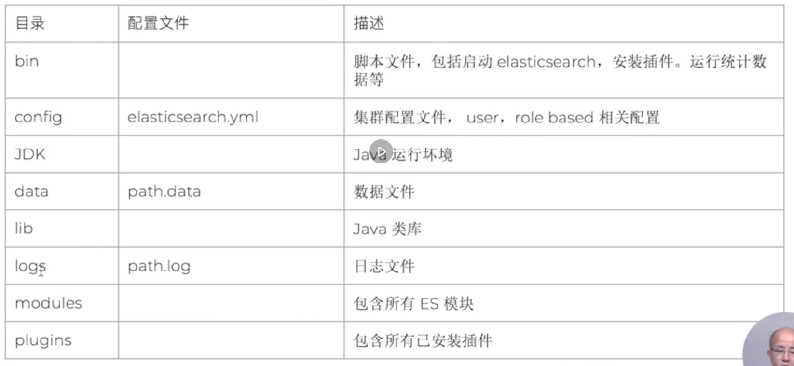

# 05 | Elasticsearch的安装与简单配置

|本期版本|上期版本 
|:---:|:---:
`Mon Jun  6 23:30:45 CST 2022` | 

* 7.0 开始，内置了 Java 环境
*  课程所用版本: 7.1.0

**Elasticsearch的目录结构**

## 如何在开发机上运行多个实例

> 相关命令查看 Github

* `cluster.name` : 集群名称
* `node.name`: 节点名称
* `path.data`: 数据存放地址
